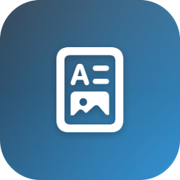

<p align="center">
  
</p>

<h1 align="center">Merview Desktop</h1>

<p align="center">
  <strong>Offline macOS app for previewing Markdown + Mermaid diagrams</strong>
</p>

---

Native macOS wrapper around [Merview](https://github.com/mickdarling/merview) — a Markdown editor with full Mermaid diagram support. Preview your `.md` files locally before committing to GitHub, with live reload as you edit.

## Features

- **Drag-and-drop** `.md` files or folders onto the window
- **Live reload** — preview updates automatically when the file changes on disk
- **Full Mermaid support** — flowcharts, sequence, class, ER, gantt, mindmap, and more
- **Fully offline** — all dependencies bundled (mermaid.js, marked.js, highlight.js, CodeMirror)
- **Open folder** with sidebar navigation (Cmd+Shift+O)
- **Native save & PDF export** via macOS save panel
- **Themes** — preview styles, syntax highlighting, editor themes, and Mermaid diagram themes

## Requirements

- macOS 13.0+
- Xcode 15+ (or Command Line Tools)
- [XcodeGen](https://github.com/yonaskolb/XcodeGen) (`brew install xcodegen`)

## Setup

```bash
git clone --recursive https://github.com/nstfn/MerviewApp.git
cd MerviewApp
make setup   # syncs submodule + downloads vendor libs + generates .xcodeproj
```

## Build & Run

```bash
make run     # builds and launches the app
```

Or open `MerviewApp.xcodeproj` in Xcode after running `make setup`.

## Makefile Targets

| Target | Description |
|--------|-------------|
| `make setup` | Full first-time setup (sync + vendor + project) |
| `make sync` | Sync Merview submodule assets and apply offline patches |
| `make vendor` | Download CDN dependencies for offline use |
| `make project` | Generate Xcode project from `project.yml` |
| `make build` | Build the app |
| `make run` | Build and launch |
| `make clean` | Clean build artifacts |

## Project Structure

```
MerviewApp/
├── Makefile                  # Build automation
├── project.yml               # XcodeGen spec
├── patches/                  # Offline patches applied to merview source
├── merview/                  # Git submodule (merview fork)
└── MerviewApp/
    ├── MerviewApp.swift      # App entry point, menu commands
    ├── ContentView.swift     # File/folder open panels
    ├── MerviewViewModel.swift # File loading + live reload watcher
    ├── MerviewWebView.swift  # WKWebView + URL scheme handler + drag-drop
    └── Resources/
        ├── Assets.xcassets/  # App icon
        └── web/
            ├── index.html    # Custom offline Merview (committed)
            ├── js/           # Synced from submodule (gitignored)
            ├── styles/       # Synced from submodule (gitignored)
            ├── docs/         # Synced from submodule (gitignored)
            └── vendor/       # Downloaded CDN libs (gitignored)
```

## How It Works

The app embeds Merview's web interface in a `WKWebView` with a custom `app://` URL scheme handler that serves bundled files — this lets `fetch()` work reliably for loading themes and styles offline. A native-to-web bridge injects file content via JavaScript, and a web-to-native bridge handles save/PDF through `WKScriptMessageHandler`. File watching uses `DispatchSource` (kqueue) for instant live reload.

## Credits

- [Merview](https://github.com/mickdarling/merview) by Mick Darling — the Markdown + Mermaid editor (AGPL-3.0)
- [Mermaid.js](https://mermaid.js.org/) — diagram rendering
- App icon generated with [sf-icon](https://github.com/nstfn/symbol-icon-maker)
